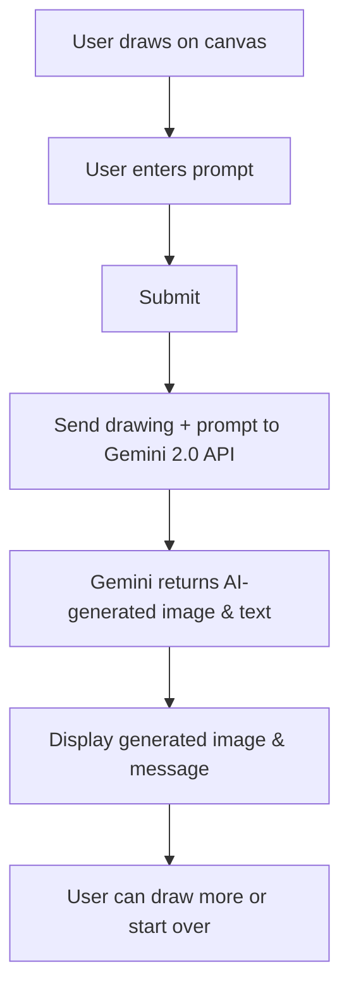

# Gemini Co-Drawing

[](LICENSE)


> **Sketch and prompt, Gemini brings your drawings to life! Co-create amazing art collaboratively with AI.**

---

## Table of Contents
- [Overview](#overview)
- [Features](#features)
- [How It Works](#how-it-works)
- [File Structure & Purpose](#file-structure--purpose)
- [Setup & Installation](#setup--installation)
- [Usage](#usage)
- [Credits](#credits)

---

## Overview
**Gemini Co-Drawing** is a web app that lets you draw on a canvas, enter a prompt, and use Google Gemini 2.0’s native image generation to create an AI-enhanced version of your drawing. It’s collaborative, creative, and leverages the latest in generative AI.

---

## Features
- 🎨 Draw freehand on a digital canvas
- 📝 Enter a prompt to guide the AI
- 🤖 Gemini 2.0 native image generation
- 🖼️ See your drawing transformed by AI
- 🌈 Color picker, clear/reset, and responsive UI
- 🔑 Custom API key support

---

## How It Works



---

## File Structure & Purpose

| File              | Purpose                                                                                   |
|-------------------|-------------------------------------------------------------------------------------------|
| `README.md`       | Project overview, setup, usage, and documentation                                         |
| `.gitignore`      | Files/folders excluded from git (logs, node_modules, local env files, etc.)               |
| `tsconfig.json`   | TypeScript configuration (ES2020, strict mode, React JSX, path aliases, etc.)             |
| `vite.config.ts`  | Vite build tool config; injects Gemini API key from `.env.local` into the app             |
| `package.json`    | Project metadata, dependencies, and scripts for dev/build/preview                         |
| `metadata.json`   | App name and description for meta purposes                                                |
| `index.html`      | HTML entry point; sets up import maps for ESM modules, root div, and loads the app        |
| `index.css`       | Minimal CSS for base color scheme and background                                          |
| `Home.tsx`        | Main React component: drawing canvas, prompt input, Gemini API integration, UI, and logic |
| `index.tsx`       | App entry point; renders `Home` into the root div                                         |

---

## Setup & Installation

**Prerequisites:** Node.js (v18+ recommended)

1. **Clone the repository:**
   ```sh
   git clone <repo-url>
   cd gemini-co-drawing
   ```
2. **Install dependencies:**
   ```sh
   npm install
   ```
3. **Set up your Gemini API key:**
   - Create a file named `.env.local` in the project root.
   - Add your Gemini API key:
     ```env
     GEMINI_API_KEY=your_actual_gemini_api_key_here
     ```
4. **Run the app locally:**
   ```sh
   npm run dev
   ```
   The app will be available at `http://localhost:5173` (or as indicated in your terminal).

---

## Usage
1. Draw on the canvas using your mouse or touch.
2. Use the color picker to change pen color.
3. Enter a prompt describing what you want the AI to generate.
4. Click the submit button (paper plane icon).
5. Wait for Gemini to return an AI-generated image and message.
6. View, save, or iterate on your creation!

---

## Credits

- **Built with Gemini 2.0 native image generation**
- By [@trudypainter](https://x.com/trudypainter) and [@alexanderchen](https://x.com/alexanderchen)
- Experimented and improved by *Me*

---

> *This project is for educational and experimental purposes. All rights to Gemini API and original authors reserved.*
